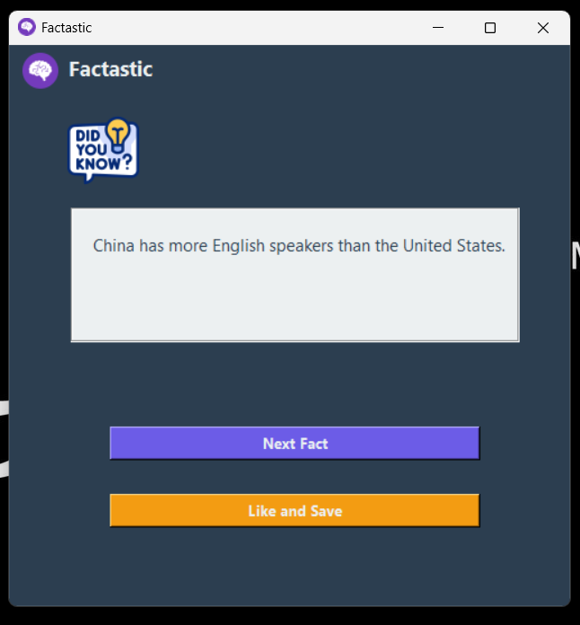

# 🧠 Factastic

**Factastic** é uma aplicação desktop feita com **Python** e **Tkinter**, criada para mostrar factos curiosos e aleatórios de forma visual, divertida e simples. A ideia é combinar APIs externas com uma interface intuitiva, entregando uma experiência agradável enquanto exploro o desenvolvimento de software.

---

## 🌟 Funcionalidades

- 🔄 Exibição de factos aleatórios ao clicar num botão.
- 💾 Opção para guardar factos favoritos (em desenvolvimento).
- 🖼️ Interface moderna com ícones e imagens para enriquecer a experiência.
- 🌐 Integração com API externa para conteúdos atualizados e dinâmicos.

---

## 📸 Visual do Aplicativo

  
*Imagem ilustrativa da interface principal do aplicativo.*

---

## 🛠️ Tecnologias Utilizadas

- **Python 3.x** – linguagem de programação.
- **Tkinter** – criação da interface gráfica.
- **Pillow** – manipulação de imagens.
- **Requests** – consumo de API externa.

---

## ⚙️ Como executar

### No Linux/macOS (bash):

```bash
git clone https://github.com/seu-usuario/factastic.git
cd factastic/src
python3 -m venv venv
source venv/bin/activate
pip install -r ../requirements.txt
python main.py
````

### No Windows(PowerShell)
```bash
git clone https://github.com/seu-usuario/factastic.git
cd factastic\src
python -m venv venv
.\venv\Scripts\Activate.ps1
pip install -r ..\requirements.txt
python main.py
```

---

## 🤝 Contribuição

Contribuições são bem-vindas!  
Se quiseres melhorar o projeto, por favor envie um pull request com as suas sugestões ou correções.

---

## 📄 Licença

Este projeto está licenciado sob a licença MIT


